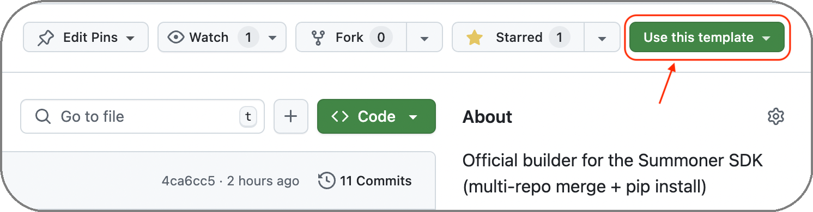

# Summoner SDK Build & Dev Script

This repository provides a **GitHub template** that includes `build_sdk.sh`, a one-stop script for managing your Summoner SDK development — from cloning the core repo and merging native modules to running smoke tests. Below is an overview of each command, its expected behavior, and example usage.

## Prerequisites

- Bash shell (Linux/macOS)  
- `git`, `python3` in your `PATH`  
- A `build.txt` file listing your native-module repo URLs (one per line)  
- Optionally a `test_build.txt` (for quick self-tests against the starter template)

## Getting Started

To create your own project using this template:

<p align="center">
  
</p>

1. Click the **“Use this template”** button at the top of the [GitHub repository page](https://github.com/Summoner-Network/summoner-sdk).
2. Select **“Create a new repository”**.
3. Name your project and click **“Create repository from template”**.

This will generate a new repository under your GitHub account with the template contents.

Clone your new repository and navigate into it:

```bash
git clone https://github.com/<your_account>/<your_repo>.git
cd <your_repo>
```

Next, define your SDK composition by editing the [`build.txt`](#buildtxt--test_buildtxt-format) file, which lists the native modules to include in your build. Then run the [`build_sdk.sh`](#how-to-run-build_sdksh) script:

```bash
source build_sdk.sh setup
```

You’re now ready to begin development.

## How to Run `build_sdk.sh`

You can invoke `build_sdk.sh` in two ways:

1. **Execute** (runs in a subshell)

   ```bash
   # Without +x
   bash build_sdk.sh <command> [variant]

   # With +x
   chmod +x build_sdk.sh
   ./build_sdk.sh <command> [variant]
   ```

   After executing `build_sdk.sh setup`, the script will have created and populated the `venv/`, but you’ll need to activate it manually:

   ```bash
   source venv/bin/activate
   ```

2. **Source** (runs in your current shell)

   ```bash
   source build_sdk.sh <command> [variant]
   ```

   When sourced, the script activates the `venv/` automatically. Your shell remains in the environment, ready to use the `summoner` SDK immediately.


### Available Commands

| Command       | Variant                                       | Description                                                                                                                                     |
| ------------- | --------------------------------------------- | ----------------------------------------------------------------------------------------------------------------------------------------------- |
| `setup`       | *(optional)* `build` (default) / `test_build` | Clone Summoner Core, merge your native modules (from `build.txt` or `test_build.txt`), create & activate a `venv/`, and run Rust/Python extras. |
| `delete`      | —                                             | Remove `summoner-sdk/`, `venv/`, `native_build/`, and any generated `test_server*` files.                                                       |
| `reset`       | —                                             | Equivalent to running `delete` followed by `setup` (fresh clone + install).                                                                     |
| `deps`        | —                                             | Reinstall Rust & Python dependencies in the existing `venv/` by rerunning `reinstall_python_sdk.sh`.                                            |
| `test_server` | —                                             | Launch a small demo server against the SDK in `venv/`, calling your package’s `hello_summoner()`.                                  |
| `clean`       | —                                             | Remove only build artifacts in `native_build/` and any `test_*.py`, `test_*.json`, or `test_*.log` files (preserves `venv/`).                   |


### Usage Examples

> ⚠️ **Tip:** For development workflows, using `source` is recommended so your shell remains in the activated environment.

```bash
# Use source to stay in the venv automatically
source build_sdk.sh setup

# Explicit build variants
source build_sdk.sh setup build
source build_sdk.sh setup test_build

# If using execution instead
bash build_sdk.sh setup
# Then activate manually:
source venv/bin/activate
```

## Command Details & Examples

### `setup [build|test_build]`

**What it does**

1. Clones `https://github.com/Summoner-Network/summoner-core.git` into `summoner-sdk/`.
2. Reads either **`build.txt`** (for your real native modules) or **`test_build.txt`** (for a quick starter-template smoke test), and clones each listed repo into `native_build/`.
3. Copies every `tooling/<pkg>/` folder into `summoner-sdk/summoner/<pkg>/`, rewriting imports (`tooling.pkg` → `pkg`).
4. Creates a Python virtualenv in `venv/` (if missing).
5. Activates `venv/`, installs build tools (`setuptools`, `wheel`, `maturin`).
6. Writes a `.env` file under `summoner-sdk/`.
7. Runs `summoner-sdk/reinstall_python_sdk.sh rust_server_v1_0_0` to pull in any Rust/Python extras (this also installs the merged SDK).

**Usage**


```bash
# default (uses build.txt)
source build_sdk.sh setup

# explicitly use build.txt
source build_sdk.sh setup build

# use test_build.txt for a quick demo against the starter template
source build_sdk.sh setup test_build
```

If you use `bash` instead of `source`, make sure you activate `venv/` by using `source venv/bin/activate` in order to use the SDK.

### `delete`

**What it does**
Removes all generated directories and files:

* `summoner-sdk/` (core clone + merged code)
* `venv/` (virtualenv)
* `native_build/` (cloned native repos)
* Any `test_server*.py` or `test_server*.json` files

**Usage**

```bash
bash build_sdk.sh delete
```

---

### `reset`

**What it does**
Shortcut for `delete` then `setup`. Cleans out everything and does a fresh bootstrap.

**Usage**

```bash
bash build_sdk.sh reset
```

---

### `deps`

**What it does**
In the existing `venv/`, reruns the Rust/Python dependency installer:

```bash
bash summoner-sdk/reinstall_python_sdk.sh rust_server_v1_0_0
```

Useful if you’ve updated core or your Rust SDK.

**Usage**

```bash
bash build_sdk.sh deps
```

---

### `test_server`

**What it does**
Runs a small demo server **against the SDK** installed in `venv/`. It:

1. Activates `venv/`
2. Copies the core’s `desktop_data/default_config.json` → `test_server_config.json`
3. Generates `test_server.py`:

   ```python
   from summoner.server import SummonerServer
   from summoner.your_package import hello_summoner

   if __name__ == "__main__":
       hello_summoner()
       SummonerServer(name="test_Server").run(config_path="test_server_config.json")
   ```
4. Launches the server

**Usage**

```bash
bash build_sdk.sh test_server
```

---

### `clean`

**What it does**
Removes only the build artifacts and test scripts, preserving `venv/`:

* `native_build/`
* Any `test_*.py`, `test_*.json`, or `test_*.log` files 

**Usage**

```bash
bash build_sdk.sh clean
```

---

## Example Workflow

```bash
# 1. Bootstrap with your real modules
source build_sdk.sh setup

# 2. Develop your native modules under tooling/
#    (edit code, commit, etc.)

# 3. If you want to test against the starter template only:
source build_sdk.sh setup test_build

# 4. Run a quick demo server
bash build_sdk.sh test_server

# 5. Remove native_build/ and test files from test_server
bash build_sdk.sh clean
```

## `build.txt` & `test_build.txt` Format

The `build.txt` and `test_build.txt` files define which native-package repositories should be included when composing the SDK. Each file lists repository URLs, one per line. Blank lines and lines starting with `#` are ignored.

You can **optionally specify which subfolders within `tooling/` to include** from each repository.


### Basic Format (include all features)

To include all available features from a repository — meaning every folder under its `tooling/` directory — just write the repo URL by itself:

```txt
# Include all tooling features from these repos
https://github.com/Summoner-Network/summoner-smart-tools.git
https://github.com/Summoner-Network/summoner-agentclass.git
```

For basic smoke testing, your `test_build.txt` can be minimal:

```txt
https://github.com/Summoner-Network/starter-template.git
```


### Filtered Format (include specific folders)

To include only specific subfolders from a repository’s `tooling/` directory, add a colon `:` after the URL, followed by the names of the folders you want (one per line):

```txt
# Only include feature1 and feature2 from this repo
https://github.com/your-org/your-repo.git:
feature1
feature2
```

Only the listed subfolders will be copied — any nonexistent folders will be skipped with a warning, but will not cause the build to fail.


### Example

```txt
# Full repo usage (includes all features)
https://github.com/Summoner-Network/summoner-smart-tools.git

# Filtered usage (only feature_x and feature_y if present)
https://github.com/Summoner-Network/summoner-agentclass.git:
feature_x
feature_y
```


This format gives you fine-grained control over which modules are included in the SDK build, making it easy to tailor your environment to specific use cases or test scenarios.
